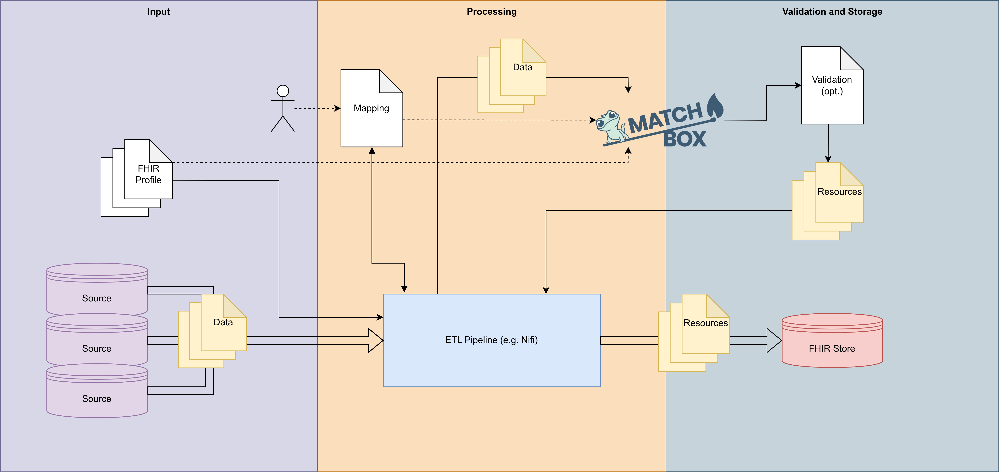

# FSH-NiFi Bridge

Enables the (automated) usage of standardized, profile-driven StructureMaps based on FHIR Shorthand (FSH) profiles for automated resource transformations via [Matchbox](https://github.com/ahdis/matchbox).

# Features
- Profile-driven FHIR `StructureMaps` for the transformation of data through [Matchbox](https://github.com/ahdis/matchbox)
- Auto-generated base StructureMaps based on input profiles through multiple layers (+ LLM-based map fix add-on [here](agent-on-fhir)):
    - Auto-generated base `ConceptMaps` for code system mapping (if required + terminology information is available)
- Basic auto-mapping function for input -> resource field mapping (TF-IDF or GloVe-based) (+ optional LLM-based map fix add-on [here](agent-on-fhir))
- FHIR Shorthand integration (through [sushi](https://github.com/FHIR/sushi))
- Local extensible cache through [Valkey](https://github.com/valkey-io/valkey) (or local disk cache)
- ETL connector for integration into existing ETL solutions ([Apache NiFi](https://github.com/apache/nifi) reference implementation)
- Small extensible plugin system to add custom information through various hooks (source definition, automapping, concept map generation, bundle creation)
- Multi-stage validations through [Matchbox](https://github.com/ahdis/matchbox) `$validate` of StructureMaps and output resources
- Instance-based validation (based on provided profile example instances) of created StructureMaps
- (optional) transformation service for handling transformations (single/batch) or validation through matchbox
- (PoC/WIP) Reverse mapping from FHIR resources back to source data (based on mapping table and source definitions)

# Workflow

## Architecture



- Workflow:
    - (FSH) Profile
    - Parser layer (parse and extract StructureDefinitions)
    - Mapping layer (Generate StructureMaps + required ConceptMaps for the transformation)
    - Controller layer (PipelineController handles pipeline run, integration into ETL pipelines)

## Prerequisites

### Python dependencies

Installable package (recommended — puts all layers on the import path):
```bash
pip install -e .            # runtime dependencies
pip install -e ".[dev]"     # + tests/linting
pip install -e ".[ml]"      # + GloVe automapper backend (torch/torchtext; TF-IDF works without it)
```

Equivalent requirements files: `requirements-bridge.txt` (canonical runtime set),
`requirements.txt` (runtime + ML + eval extras), `requirements-dev.txt` (tests/linting).

### FHIR package cache
Install FHIR IG packages (npm) into `data/resource_cache/` so StructureDefinitions can be resolved locally without network access.

Either use the provided installation script in `scripts/add_simplifier_package.py`:

```
python scripts/add_simplifier_package.py --package-name de.basisprofil.r4 --package-version 1.5.3
```

OR install via npm directly:

```bash
npm install --prefix data/resource_cache hl7.fhir.r4.core
npm install --prefix data/resource_cache de.basisprofil.r4
```

### Services (Valkey + Matchbox)
By default the app uses Valkey as an in-memory resource cache and delegates transformation/validation to a Matchbox FHIR server. Both are defined in `docker-compose.yml`:
```bash
docker compose up -d valkey matchbox      # matchbox on http://localhost:8080/matchboxv3/
docker compose --profile nifi up -d       # optionally: bridge + NiFi (see ETL integration)
```
A system-level Valkey on `localhost:6379` works as well. Alternatively configure `"external_cache_service": "DISK"` for a file-based cache (no service needed).

## Configuration

All settings live in `conf/default.json` (or a custom config passed with `-c`):

| Key                       | Description                                                                                                                          |
|---------------------------|--------------------------------------------------------------------------------------------------------------------------------------|
| `project_path`            | Output directory for a processing run                                                                                                |
| `profile_path`            | Directory containing input FSH-generated JSON profiles (keep empty for projects)                                                     |
| `resource_cache_path`     | Path to local npm FHIR packages                                                                                                      |
| `input_source_example`    | Flat source-data example/structure used for source-definition generation                                                             |
| `external_cache_service`  | currently: `"VALKEY"` (default) or `"DISK"`                                                                                          |
| `cache_args`              | Connection params for the chosen cache (e.g. `valkey_host`, `valkey_port`)                                                           |
| `matchbox_connection.url` | Matchbox server base URL                                                                                                             |
| `socket_connection`       | UNIX socket `path` (default `/tmp/fsh_nifi_bridge.sock`), worker settings (`max_workers`, `worker_processes`, `validation_interval`) |
| `terminology_server_uri`  | Terminology server for CodeSystem/ValueSet queries                                                                                   |
| `plugins`                 | Optional build-time plugin configuration (e.g. `{"type": "redcap", ...}`)                                                            |
| `external_reference_defaults` | Optional explicit cross-project/external `Reference` fallbacks applied during bundle assembly; never inferred and never overwrite mapped or bundle-wired references |

An external reference can be limited to a resource type and profile. It is
applied only when the field is still empty after normal bundle wiring:

```json
{
  "external_reference_defaults": [
    {
      "source_type": "Observation",
      "source_profile": "mii-pr-molgen-example",
      "path": "subject",
      "value": {
        "reference": "Patient/external-patient-1",
        "type": "Patient"
      }
    }
  ]
}
```

## Usage

The CLI entry point is `src/main.py` (`src/controller/service_controller.py`) commands are subcommand-based.

### Project setup

```bash
# From pre-compiled JSON profiles (folder or npm .tgz)
python src/main.py -c conf/myproject.json init path/to/profiles/

# From FSH sources: compile with SUSHI (docker) and initialize the project
python src/main.py process-fsh path/to/fsh-project -n myproject
```

### Pipeline
```bash
# All steps: parse → source-def → StructureMap generation in minimal mode (-msm) (+ optional upload)
python src/main.py -c conf/myproject.json pipeline run -msm -crm \
    -mt projects/myproject/source_data/mapping_table.json --prepare-matchbox

# Or step by step
python src/main.py -c conf/myproject.json pipeline process           # 1: parse profiles, add to the internal registry
python src/main.py -c conf/myproject.json pipeline source-def        # 2: source helper StructureDefinition
python src/main.py -c conf/myproject.json pipeline static-gen-sm -msm -mt <table.json>  # 3: generate initial structure maps statically
python src/main.py -c conf/myproject.json pipeline prepare-matchbox  # 4: upload SDs/CMs/maps (-f to force overwrite)

# Utilities
python src/main.py -c conf/myproject.json pipeline export-fields -o fields.json      # mappable target paths per profile
python src/main.py -c conf/myproject.json pipeline validate -i out.json -p <profile> # $validate one resource
python src/main.py -c conf/myproject.json pipeline validate-instances                # extract IG example instances, then $validate + round-trip
```
Useful flags: `-f` force overwrite, `-msm` minimal maps (only mapped fields), `-crm` reference wiring rules, `-am` auto-mapping.

### Service
```bash
python src/main.py server start    # start the background bridge server (UNIX socket)
python src/main.py server status   # check whether the server is running
python src/main.py server stop     # stop the server
```

### Matchbox CLI
```bash
python src/main.py matchbox-cli --help
```
Supports: upload/delete StructureDefinitions and StructureMaps, trigger `$transform` (`transform-data`), `$validate`, install NPM packages, query resources by type/id/url.

### Cache cli
```bash
python src/main.py cache list
python src/main.py cache stats
python src/main.py cache get   "http://example.org/StructureDefinition/my-profile"
python src/main.py cache add   data/json/StructureDefinition-test.json
python src/main.py cache delete "http://example.org/old-profile"
python src/main.py cache clear
```

### Socket client (prepared requests to the service)
```bash
python src/main.py client send-request -m status
python src/main.py client send-request -m transform_data \
    -p '{"profile": {"url": "http://example.org/StructureMap/test"}}' \
    -d '{"resourceType":"Patient","id":"123"}'

# Bash wrapper
./scripts/test_socket_client.sh --method validate_setup
```

Available server methods: `status`, `stop`, `transform_data`, `transform_batch`, `validate_data`, `validate_setup`, `prepare_matchbox`. The socket is UNIX-socket only; the path is configurable via `socket_connection.path`.

## ETL integration

`ETLConnector` (`src/controller/etl_controller/etl_controller.py`) is an abstract base class that wraps a `SocketClient` and defines the following functions:

| Hook                                 | Purpose                                       |
|--------------------------------------|-----------------------------------------------|
| `validate_setup()`                   | Check bridge/Matchbox readiness               |
| `ingest_source_data(raw)`            | Normalize raw input from the ETL tool         |
| `transform_data(payload)`            | Send data for FML transformation via Matchbox |
| `validate_transformed_data(payload)` | Validate output against a FHIR profile        |
| `return_data(payload)`               | Hand the result back to the ETL tool          |
| `emit_log / emit_error`              | Tool-specific logging and error routing       |

`NiFiETLConnector` (`nifi_connector.py`) implements `ETLConnector` for Apache NiFi 2.x Python processors via `FlowFileTransform`. `scripts/e2e_kfdm_smoke.sh` exercises the full FSH → SUSHI → pipeline → Matchbox → NiFi chain as a scripted smoke test.

## Testing
```bash
pytest tests/unit tests/integration          # offline suite (no services needed)
pytest --cov=src --cov-report=html           # with coverage
```

## Evaluation
-> will be found in the `eval` directory

## Project structure

Initialize a project using `python src/main.py init [source]`. Each processing run creates a project under `projects/<name>/`:

```
projects/<name>/
├── input_profile/        FSH-generated JSON StructureDefinitions (+ CodeSystems/ValueSets)
├── processed_resources/  Parsed resource metadata (registry objects)
├── source_definitions/   Generated source helper StructureDefinitions
├── structure_maps/       Generated FML StructureMaps
├── source_data/          Source example, mapping_table.json, concept_maps/, coverage report
├── examples/             IG example instances (for validate-instances)
└── converted_data/       Transformation outputs and validation reports
```

## Links
- [fhir.resources](https://github.com/nazrulworld/fhir.resources)
- [Matchbox FHIR server](https://github.com/ahdis/matchbox)
- [FHIR Mapping Language spec](https://www.hl7.org/fhir/mapping-language.html)
- [Valkey](https://valkey.io/)
